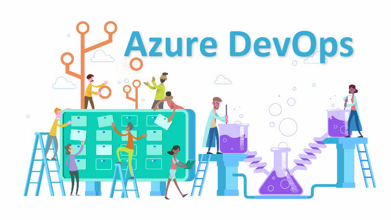
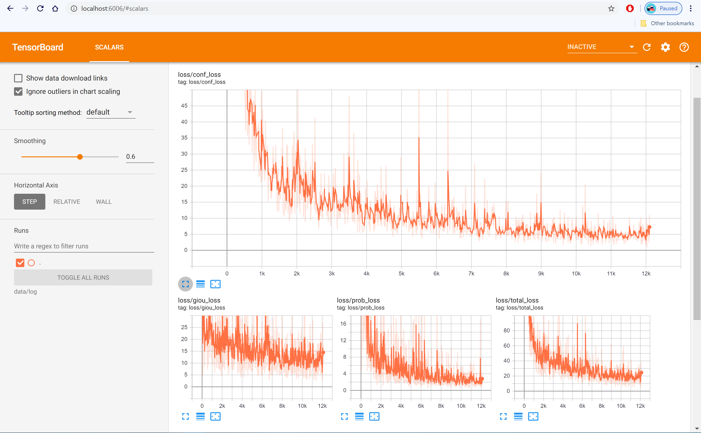
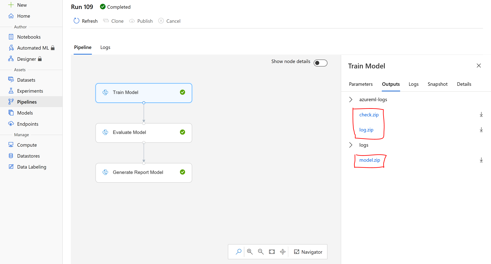
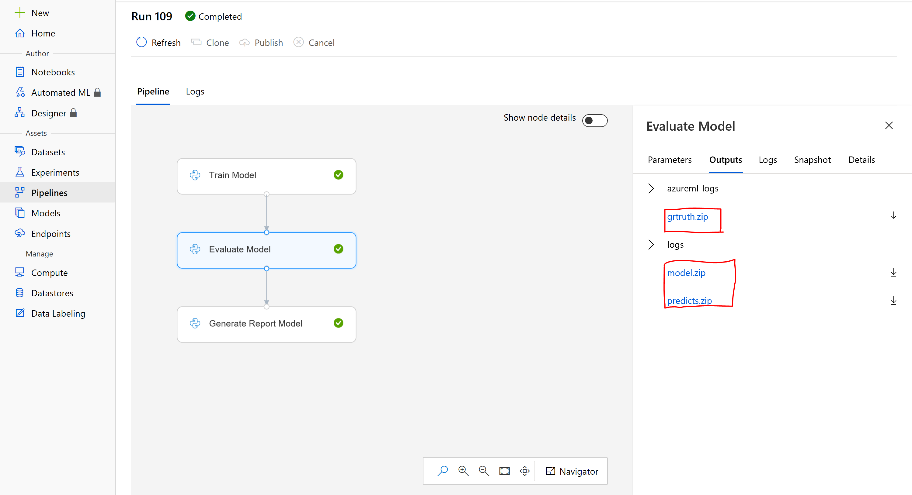
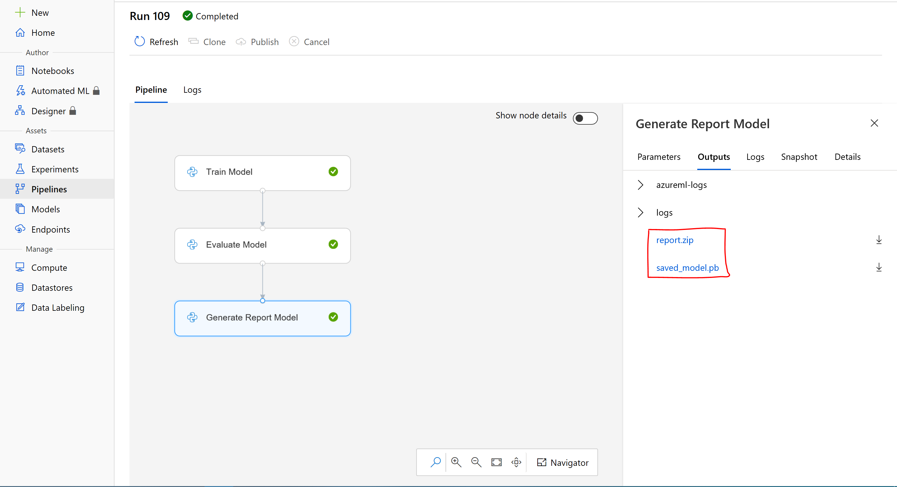
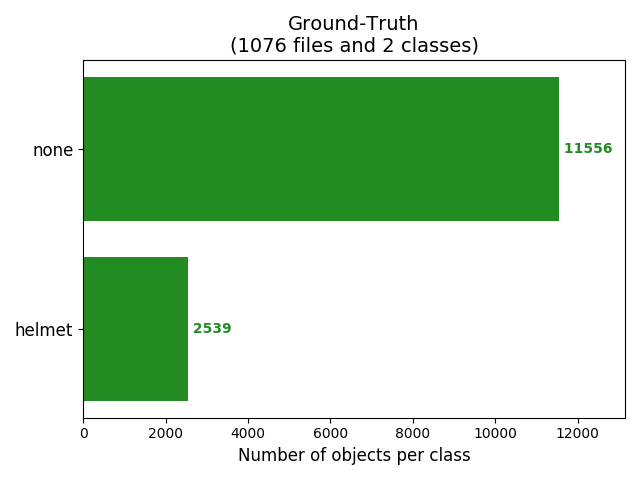
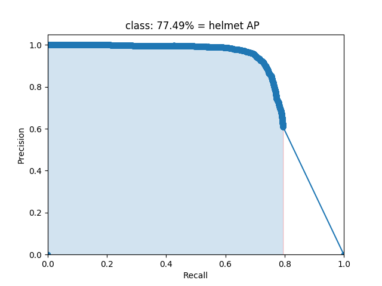
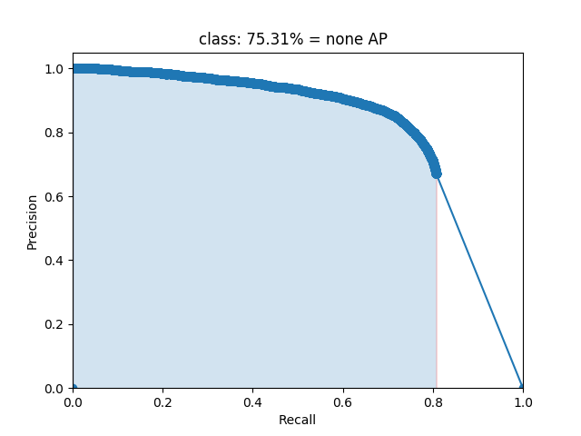
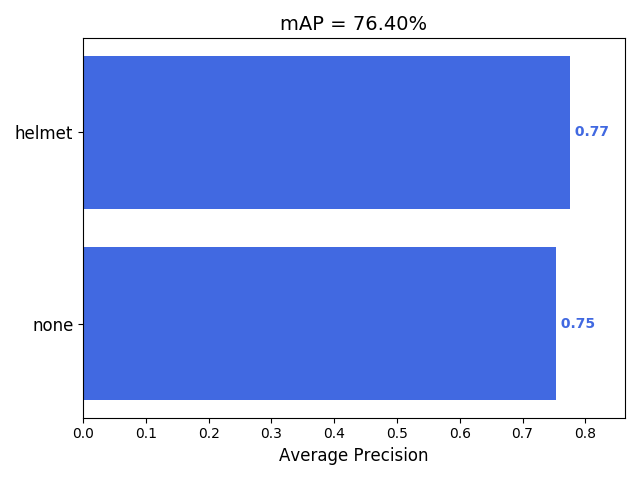
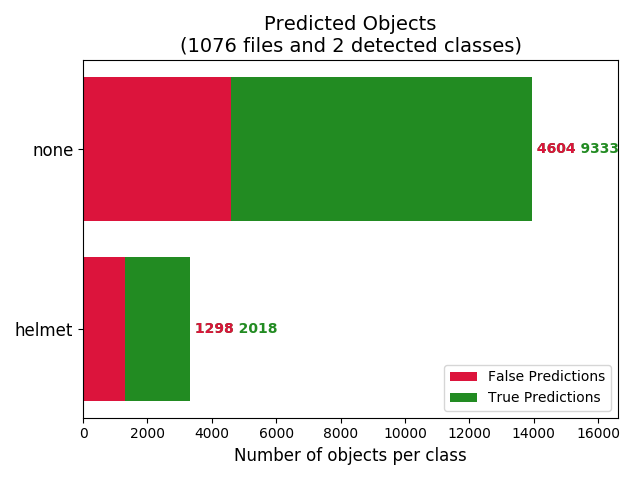

# MLOps practices using Azure ML service with Python SDK for Tensorflow 2.0 YoloV3 model training

This example belongs [Official Azure MLOps repo](https://github.com/Microsoft/MLOps). The objetive of this scenario is to create your own **YoloV3** training by **MLOps** tasks. This sample shows you how to operationalize your Machine Learning development
cycle with **Azure Machine Learning Service**  with **Tensorflow 2.0** using YoloV3 architecture - as a
compute target - by **leveraging Azure DevOps Pipelines** as the orchestrator for the whole flow.

By running this project, you will have the opportunity to work with Azure
workloads, such as:

|Technology|Objective/Reason|
|----------|----------------|
|Azure DevOps|The platform to help you implement DevOps practices on your scenario|
|Azure Machine Learning Service|Manage Machine Learning models with the power of Azure|
|Tensorflow 2.0|Use its power for training models|
|YoloV3|Deep Learning Architecture model for Object Detection|


# MLOps on Azure
- [](https://dev.azure.com/aidemos/MLOps/_build/latest?definitionId=96?branchName=master)
- [Example MLOps Release Pipeline](https://dev.azure.com/customai/DevopsForAI-AML/_release?view=all&_a=releases&definitionId=16)
- [Official Python Azure MLOps repo](https://github.com/Microsoft/MLOpsPython)
- [MLOps Architecture Deep Dive video](https://www.youtube.com/watch?v=nst3UAGpiBA)


## What is MLOps?
MLOps empowers data scientists and app developers to help bring ML models to production. 
MLOps enables you to track / version / audit / certify / re-use every asset in your ML lifecycle and provides orchestration services to streamline managing this lifecycle.

### MLOps podcast
Check out the recent TwiML podcast on MLOps [here](https://twimlai.com/twiml-talk-321-enterprise-readiness-mlops-and-lifecycle-management-with-jordan-edwards/) 

## How does Azure ML help with MLOps?
Azure ML contains a number of asset management and orchestration services to help you manage the lifecycle of your model training & deployment workflows.

With **Azure ML + Azure DevOps** you can effectively and cohesively manage your datasets, experiments, models, and ML-infused applications.


## New MLOps features
- [Azure DevOps Machine Learning extension](https://marketplace.visualstudio.com/items?itemName=ms-air-aiagility.vss-services-azureml) 
- [Azure ML CLI](https://aka.ms/azmlcli)
- [Create event driven workflows](https://docs.microsoft.com/azure/machine-learning/service/how-to-use-event-grid) using Azure Machine Learning and Azure Event Grid for scenarios such as triggering retraining pipelines
- [Set up model training & deployment with Azure DevOps](https://docs.microsoft.com/en-us/azure/devops/pipelines/targets/azure-machine-learning?view=azure-devops)

> If you are using the Machine Learning DevOps extension, you can access model name and version info using these variables:
> - Model Name: Release.Artifacts.{alias}.DefinitionName containing model name
> - Model Version: Release.Artifacts.{alias}.BuildNumber 
> where alias is source alias set while adding the release artifact. 

## Getting Started / MLOps Workflow
An example repo which exercises our recommended flow can be found [here](https://github.com/Microsoft/MLOpsPython)

## MLOps Best Practices
### Train Model
- Data scientists work in topic branches off of master.
- When code is pushed to the Git repo, trigger a CI (continuous integration) pipeline.
- First run: Provision infra-as-code (ML workspace, compute targets, datastores).
- For new code: Every time new code is committed to the repo, run unit tests, data quality checks, train model.

We recommend the following steps in your CI process:
- **Train Model** - run training code / algo & output a [model](https://docs.microsoft.com/en-us/azure/machine-learning/concept-azure-machine-learning-architecture#model) file which is stored in the [run history](https://docs.microsoft.com/en-us/azure/machine-learning/service/concept-azure-machine-learning-architecture#run).
- **Evaluate Model** - compare the performance of newly trained model with the model in production. If the new model performs better than the production model, the following steps are executed. If not, they will be skipped.
- **Register Model** - take the best model and register it with the [Azure ML Model registry](https://docs.microsoft.com/en-us/azure/machine-learning/service/concept-azure-machine-learning-architecture#model-registry). This allows us to version control it.

***

## Project structure

```
.
├── .pipelines                          # Continuous integration 
├── code                                # Source directory
├── docs                                # Docs and readme info
├── environment_setup                        
|── .gitignore
├── README.md   

```

## Prerequisites
- Active Azure subscription
- At least contributor access to Azure subscription
- Permissions Azure DevOps project, at least as contributor.
- Conda set up

***

## Virtual environment
To create the virual environment, we need to have anaconda installed in our computer. It can be downloaded in this [link](https://www.anaconda.com/download/).

For this project there will be two virtual environments. One, with all the packages related to the person module and another one, with the packages related to the PPE module.

To create the virtual environment the _requirements.txt_ file will be used. It containts all the dependencies required.

To create the environment, first you will need to create a conda environment:

Go to `code\ppe\experiment\ml_service\pipelines\environment_ppe.yml`

`conda create --name <environment_name>`

Once the environment is created, to activate it:

`activate <environment-name>`

To deactivate the environment:

`deactivate <environment-name>`

### PPE module



## Pipelines
#### CI-PPE Module
This pipeline will update the docker image when any change is done to the Dockerfile and it will create an artifact with the IoT manifest. Where the ACR password, username and the Docer image name will be automatically filled with the values specified in the DevOps Library.

### CI - Infrastructure As Code
This pipeline will automatically create the resource group and the services needed in the subscription that will be specified in the *cloud_environment.json* file located in the *environment_setup/arm_templates* folder.

This pipeline will be automatically triggered when a change is done in the ARM template.

### CI - MLOps
MLOps will help you to understand how to build the Continuous Integration and Continuous Delivery pipeline for a ML/AI project. We will be using the Azure DevOps Project for build and release/deployment pipelines along with Azure ML services for model retraining pipeline, model management and operationalization.


This template contains code and pipeline definition for a machine learning project demonstrating how to automate an end to end ML/AI workflow. The build pipelines include DevOps tasks for check quality, generate/update datstore in our AML resource, generate Pascal VOC annotation, model training on different compute targets, model version management, model evaluation/model selection, model deployment embedded on IoT Module (Edge).

### Continuous Integration
There will be two continuouos integration (CI) pipelines. One, where all the infraestructure will be set up (CI-IaC) and other more specific to AI projects (CI-MLOps)

Any of this pipelines can be manually triggered. To do so, you should go to the Azure DevOps portal, click on Pipelines>Pipelines, select the desired pipeline and click on run pipeline.

During the continuous integration an artifact is created that will leater be released during the continuous deployment.


### Azure Machine Learning Pipeline

#### Train step

1. model.zip -> Zip with saved_model.pb with variables files
2. log.zip -> Zip with tf runs logs. Download it and view in your local with Tensorboard the progress of your training

- `tensorboard --logdir=data/log`

- Go to `http://localhost:6006/`



3. checkpoints -> Zip with weights of the Tensorflow model



#### Evaluate step

1. grtruth.zip -> Zip with ground truth detections
2. predicted.zip -> Zip with predicted detections
3. model.zip -> Zip with saved_model.pb with variables files



#### Report step

1. saved_model.pb -> Tensorflow model 
2. report.zip -> Zip with metrics results and plots



#### Final report of AML Pipeline


mAP.png





### References

- [Azure Machine Learning(Azure ML) Service Workspace](https://docs.microsoft.com/en-us/azure/machine-learning/service/overview-what-is-azure-ml)
- [Azure ML CLI](https://docs.microsoft.com/en-us/azure/machine-learning/service/reference-azure-machine-learning-cli)
- [Azure ML Samples](https://docs.microsoft.com/en-us/azure/machine-learning/service/samples-notebooks)
- [Azure ML Python SDK Quickstart](https://docs.microsoft.com/en-us/azure/machine-learning/service/quickstart-create-workspace-with-python)
- [Azure DevOps](https://docs.microsoft.com/en-us/azure/devops/?view=vsts)
